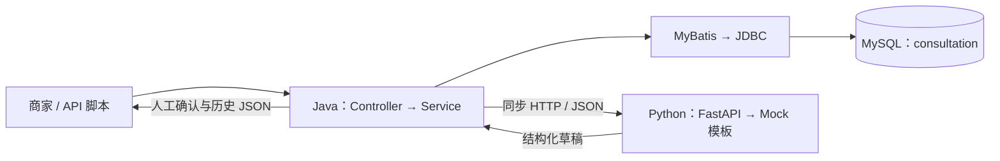

# 种子咨询与售后协作助手

## 项目解决什么问题

种子商家在微信反复解释发芽率等问题，回复费时，原问题和处理结果也不容易统一查找。本项目让商家先保存咨询，再由 Python 生成待核实草稿，人工修改确认后查看历史。确认表示内部处理完成，实际回复仍由商家在微信等渠道手动发送。

当前以柔毛淫羊藿种子的发芽率咨询为演示场景。Mock 是预设模板，不是真实大模型；没有检测依据时不生成发芽率数字，也不会自动判断任意种植问题。

## 当前完成程度

MVP 阶段 1—3 已完成并确认：双服务骨架 → Java↔Python Mock 调用 → MySQL 咨询、草稿、人工回复持久化闭环。业务代码基线为 `98cd597`。

已实现创建、详情、历史分页、生成一次草稿、人工保存/确认、版本冲突处理及故障提示。尚无前端、登录、真实 AI、RAG、MQ、Redis、语音、微信/抖音接入或高并发容量验证。下一阶段尚未授权，不将当前阶段称为整体计划书 G1 或生产系统验收完成。

## 核心技术栈

| 归属 | 技术 | 形象作用 |
| --- | --- | --- |
| 前端 | 尚未实现；通过 API 脚本操作 | 暂无商家网页窗口 |
| Java 后端 | Java 21、Spring Boot 4.0.8、Validation、RestClient | 业务调度员：检查输入、安排草稿、管理确认规则 |
| 数据访问 | MyBatis 4.0.0、JDBC、MySQL Connector/J | 按 SQL 翻台账，把数据库结果变成 Java 对象 |
| 数据库 | 现有 MySQL 8.4、InnoDB | 正式台账：应用重启后仍保存记录 |
| Python 后端 | Python 3.12、FastAPI、Pydantic、Uvicorn | 草稿助手的接口、格式检查员与 HTTP 服务器 |
| 运行与验证 | Maven Wrapper、venv/pip、JUnit、pytest、httpx、Git | 构建工具、独立依赖柜、检查工具和版本相册 |

选型的原因、代价和升级条件见 [技术决策](docs/decisions.md)。

## 系统整体架构



Python 不直接访问业务数据库。详细数据流、状态与事务见 [架构](docs/architecture.md)。

## 最短启动方法

首次运行先完成 [开发环境准备与数据库初始化](docs/development.md)。以下用于已安装依赖、已建表的 Windows 环境，在项目根目录打开两个 PowerShell。

终端 A：构建并启动 Java，只有出现 BUILD SUCCESS 才执行启动命令。

```powershell
. .\scripts\use-local-tools.ps1 -JdkHome 'D:\dev\sdk'
.\backend-java\mvnw.cmd -B -ntp -s config/maven-mirror.xml '-Dmaven.repo.local=.m2/repository' -f backend-java/pom.xml verify
java -jar .\backend-java\target\seed-service-0.1.0-SNAPSHOT.jar
```

终端 B：启动 Python。

```powershell
.\ai-service\.venv\Scripts\python.exe -m uvicorn app.main:app --app-dir ai-service --host 127.0.0.1 --port 8000
```

现有 MySQL 须可通过 localhost:3306 连接。健康入口：[Java](http://127.0.0.1:8080/actuator/health)、[Python](http://127.0.0.1:8000/health)。Ctrl+C 停止对应项目服务。

## 核心业务流程

保存原问题 → 生成并保存 Mock 草稿 → 人工编辑/确认 → 查询历史。Python 失败时可跳过生成，人工直接处理。原草稿与人工回复分开保存；已确认记录只读。

双服务启动后，新开终端从项目根目录执行：

```powershell
.\ai-service\.venv\Scripts\python.exe scripts/check-persistence.py flow
```

该脚本会创建明确标记的合成咨询并保留，以便重启读回。接口清单见 [架构](docs/architecture.md)。

## 测试状态

最近业务验收日期：2026-09-09；版本：`98cd597`。Java 13 项、Python 9 项通过；真实双服务、MySQL 保存/查询/确认、并发冲突、Python 故障人工接管和 Java 重启读回通过。2026-09-10 文档整理未重新运行业务测试，不把旧结果写成本日新测试。

测试命令、证据边界与已知提示统一见 [测试](docs/testing.md)。

## docs 文档导航

初学者建议先读本页，再读面试笔记的“业务入门”和“Java 语法”，随后跟着架构读一条请求；需要运行时打开开发文档。

| 文档 | 什么时候看 |
| --- | --- |
| [interview-notes.md](docs/interview-notes.md) | 不懂业务、Java 语法，或准备面试复述 |
| [architecture.md](docs/architecture.md) | 看当前系统怎样工作、数据怎样流动 |
| [development.md](docs/development.md) | 安装、配置、启动、排查环境问题 |
| [testing.md](docs/testing.md) | 运行检查、核对哪些结果真的验证过 |
| [decisions.md](docs/decisions.md) | 回答为什么这样选、什么时候需要升级 |
| [changelog.md](docs/changelog.md) | 查阶段成果与 Git 提交 |

[整体计划书](项目整体计划书.md) 仅保留长期业务路线，不作为当前实现清单；当前范围以本页和架构为准。[AGENTS.md](AGENTS.md) 保存长期协作与 MySQL 操作边界。
