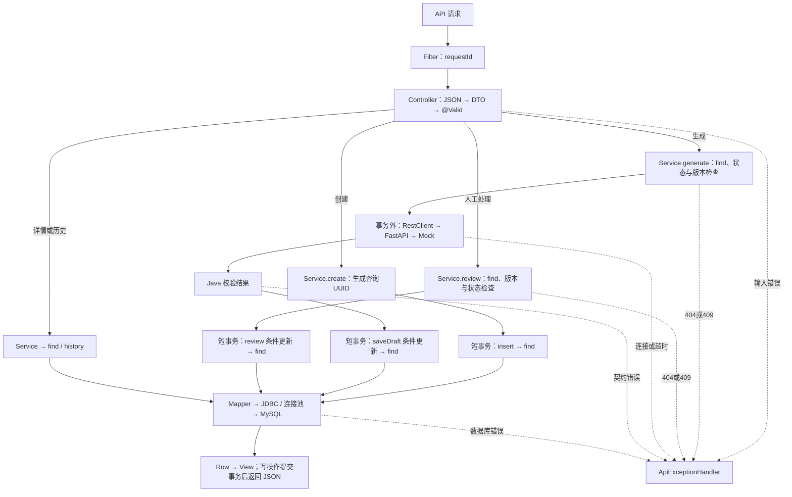
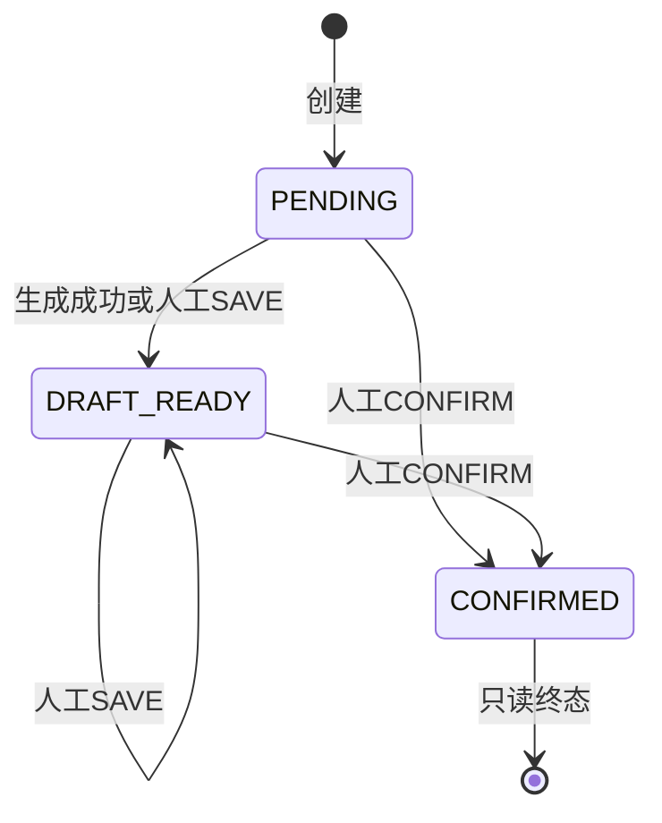

# 当前系统架构

[返回 README](../README.md) · 选型理由见 [decisions](decisions.md) · 启动见 [development](development.md)

## 设计边界与双服务分工

当前只处理文字咨询、Mock 草稿、人工回复及历史；暂不实现前端、登录、真实 AI、RAG、MQ、Redis、语音或平台接入。长期计划中的分类、证据引用、任务队列、工单、资料审核不是已实现功能。

Java 是业务调度员，唯一负责业务表的读取、状态规则和写入；Python 是可替换的草稿助手，只接收问题和批次，返回结构化结果。拆分便于分别学习 Java 业务开发和 Python AI 生态，代价是两套环境与网络故障处理；业务本身并非必须拆成两种语言。

## Java ↔ Python 协议

Java [PythonDraftClient.generate()](../backend-java/src/main/java/com/seedassistant/draft/PythonDraftClient.java) 复用 RestClient，通过 JDK HttpClient 以 HTTP/1.1 同步 POST 到 `/internal/v1/germination-drafts`。

输入：requestId、question、可选 batchCode。输出：requestId、answerDraft、missingFields、needsHumanReview=true、mode=mock。Java 校验字段约束、编号一致性、模式、审核标记与缺失项；HTTP 200 不能代替契约校验。连接超时2秒、读取超时3秒，无自动重试。

Python [main.py](../ai-service/app/main.py) 使用 Pydantic 校验，调用 [mock_generator.py](../ai-service/app/mock_generator.py) 按有无批次选择模板。不分析任意问题语义，不返回无依据的发芽率。Java 保存的原问题不变，发送给 Python 的文字去除首尾空白。

[RequestIdFilter](../backend-java/src/main/java/com/seedassistant/common/RequestIdFilter.java) 为每次 HTTP 请求生成编号，传到 Python 并放入 X-Request-Id 响应头；它不同于长期定位咨询的 id，也不是幂等键。

## Controller → Service → Mapper → MySQL

| 层及核心文件 | 职责与输入输出 |
| --- | --- |
| [ConsultationController](../backend-java/src/main/java/com/seedassistant/consultation/ConsultationController.java) | 路由、JSON 与 @Valid；调用 Service，返回 HTTP 状态和 View |
| [DraftModels.Request](../backend-java/src/main/java/com/seedassistant/draft/DraftModels.java) / [Consultation records](../backend-java/src/main/java/com/seedassistant/consultation/Consultation.java) | 定义提交字段、版本、编辑动作、数据库 Row、接口 View 与分页 Page |
| [ConsultationService](../backend-java/src/main/java/com/seedassistant/consultation/ConsultationService.java) | create/get/history/generate/review；业务规则、短事务、Row→View 转换 |
| [ConsultationMapper](../backend-java/src/main/java/com/seedassistant/consultation/ConsultationMapper.java) | MyBatis 代理执行绑定参数的 SQL；返回影响行数或 Row |
| JDBC / MySQL 驱动 / HikariCP | 复用连接、传递 SQL、映射异常；不是另一份手写业务代码 |
| MySQL InnoDB | 约束、索引、事务与持久化；只连接现有 localhost:3306 |

### API 合约

| 操作 | 请求 | 成功响应 |
| --- | --- | --- |
| 创建 | POST /api/v1/consultations；question、可选batchCode | 201、Location及View；PENDING/version=0 |
| 详情 | GET /api/v1/consultations/{id} | 200、View |
| 历史 | GET /api/v1/consultations?page=1&size=20 | 200、items/page/size/hasMore |
| 生成 | POST /api/v1/consultations/{id}/draft；version | 200、View |
| 人工处理 | PATCH /api/v1/consultations/{id}/review；version、finalAnswer、action=SAVE或CONFIRM | 200、View |
| 旧预览 | POST /api/v1/germination-drafts；question、可选batchCode | 200、requestId/data；不读写数据库 |

question 非空白、最多2000字符；batchCode 可缺省/null，传值须为1–40位大写字母、数字或短横线；finalAnswer 非空白、最多4000字符；version 必填且非负；路径编号须是UUID。

历史默认20条、最多100条，页码1–1000；按 created_at、id 倒序，OFFSET=(page-1)*size，多查一条判断 hasMore，不返回总数。它不是稳定快照分页，并发新增可能改变跨页结果；当前没有深分页性能承诺。

### 完整数据流

## 最小数据模型

一张 consultation 表，无外键关系；一条咨询最多保留一份成功生成的原始草稿和一份当前人工回复。SQL 原文：[001_create_consultation.sql](../scripts/sql/001_create_consultation.sql)。

| 字段 | 类型与约束 | 意义 |
| --- | --- | --- |
| id | CHAR(36)，ascii_bin，主键 | Java生成UUID |
| question | VARCHAR(2000)，非空 | 原问题 |
| batch_code | VARCHAR(40)，可空 | 可选批次，非检测证据 |
| status | VARCHAR(20)，默认PENDING | 当前业务状态 |
| draft_result | JSON，可空 | Python完整结果快照 |
| final_answer | VARCHAR(4000)，可空 | 人工回复，独立于原草稿 |
| version | BIGINT，非空，默认0 | 有效更新后加1 |
| created_at / updated_at | DATETIME(6)，默认UTC时间 | 创建与更新时间 |
| confirmed_at | DATETIME(6)，可空 | 确认时写入 |

CHECK 限制状态、非负版本、问题非空、确认必须有回复和时间；索引 `(created_at DESC, id DESC)` 服务历史排序。数据库约束与Java校验共同保护数据，但不检查农业事实。JSON便于保存小快照，暂不支持多次生成历史或完整审计。

DATETIME本身不携带时区；项目约定存UTC，Row用LocalDateTime，View用OffsetDateTime明确UTC。JSON字符串在view()中转换为Result对象后返回。

## 状态流转

DRAFT_READY也可能来自纯人工保存，此时draft_result可以为空。生成只允许PENDING；人工SAVE后不能再走生成。确认只表示内部回复已确认，不表示已在微信发送或客户已解决问题。

## 事务边界与乐观锁

create：生成UUID → 在一个TransactionTemplate短事务中insert和find。generate：先查询并校验 → 事务外调用Python → 短事务条件更新并读回。review：先校验 → 短事务条件更新并读回。成功后提交；回调内运行时异常使事务回滚。

更新SQL必须同时匹配id、version和允许的状态，并设置version=version+1。影响1行才成功，0行抛409。Java提前检查改善错误反馈，数据库条件更新才防止检查后发生的竞态。

例如A、B都读到版本1，A成功更新为2，B携带版本1更新影响0行；B应重新查询内容，不能盲目替换版本自动覆盖。乐观锁并不意味着InnoDB执行UPDATE时不加锁。

并发生成可能调用Python多次，但只有一个符合条件的结果生效。创建没有幂等键，重复POST会创建新记录；没有任务恢复、消息去重或“只调用一次”保证。

## 异常与故障隔离

[ApiExceptionHandler](../backend-java/src/main/java/com/seedassistant/common/ApiExceptionHandler.java) 返回code、message、requestId，不透传SQL、内部地址和上游堆栈。

| HTTP | code | 当前含义 |
| --- | --- | --- |
| 400 | INVALID_REQUEST | JSON、字段、路径或分页无效 |
| 404 | CONSULTATION_NOT_FOUND | 咨询不存在 |
| 409 | CONSULTATION_CONFLICT | 旧版本或状态不允许 |
| 502 | AI_BAD_RESPONSE | 上游错误响应或契约不符 |
| 503 | AI_UNAVAILABLE / DATABASE_UNAVAILABLE | Python连接失败或数据库连接类故障 |
| 504 | AI_TIMEOUT | 上游调用超时 |
| 500 | DATABASE_ERROR | 其他数据库操作错误 |

Python失败不修改原咨询，可人工SAVE/CONFIRM；MySQL失败则持久化功能不可用，但旧预览可继续，因为它不依赖数据库。连接池延迟初始化允许Java启动，实际health仍会检查数据库，不把启动成功等同业务成功。

提交时连接中断可能导致调用方不知道事务是否成功，应按已知咨询id查询；不能把所有503都解释为“肯定没有写入”。当前故障隔离只是边界和人工替代路径，尚无熔断器、独立线程舱壁或生产级隔离保证。

## 后续演进方向（未实施）

先验证商家录入成本与操作流程，再按确认范围考虑最小工作台。出现慢模型和排队需求时评估持久任务、幂等与有界并发；出现SQL瓶颈时用真实测量决定游标分页和索引调整；出现持续表结构变更时引入迁移工具。鉴权、真实资料、AI评估与部署另行验收。原计划中的并发指标是目标，不是成果。
