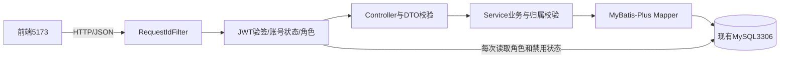

# 架构与版本路线

[项目入口](../README.md)

## 认证边界

注册固定创建CUSTOMER，用户名规范化、唯一约束与BCrypt沿用V2。AuthService验证哈希后由JwtService签发15分钟JWT。登录失败统一提示，不区分不存在、错密码或禁用账号；不存在的用户名也执行一次哈希比较。

JWT使用Spring Security提供的Nimbus编码器/解码器，固定HS256，验证签名、issuer、audience、subject、issuedAt和expiresAt。不自己实现加密算法。至少32字节随机密钥仅保存在项目config/auth.local.properties，缺失或过短时拒绝启动；更换密钥会使旧令牌不可用。

JwtAuthenticationFilter只从Authorization读取Bearer令牌。每次查询MySQL里的当前角色和状态，不信任前端角色，不在JWT内保存密码或角色；禁用期间拒绝旧Token，重新启用后未到期Token仍可用。数据库故障返回503，不伪装成密码错误。

SecurityFilterChain采用STATELESS，不创建登录Session，不启用表单登录或Basic认证。没有Cookie认证，前端也不发送Cookie，因此关闭CSRF表单保护。CORS仅允许localhost/127.0.0.1:5173；CORS不代替权限检查。RequestIdFilter先于认证执行，401/403也有请求编号和JSON错误。

前端Token只存内存，刷新或退出清除；本版没有刷新令牌或服务端退出撤销。退出页面后，被复制的Token在到期/禁用账号前仍有效。当前短期令牌配合本机演示足够，公开部署前再评估HTTPS、登录防滥用和撤销机制。

## 业务与持久层

- 分类与文章管理、旧consultations/预览仅商家可用；目前按同一商家组织的工作人员理解MERCHANT，不是多租户平台。
- 会话Controller调用SessionAccessService统一检查归属，再复用ConsultationSessionService的CRUD规则。客户只能访问自己的会话；访问别人或未归属记录统一404。商家可访问所有记录。
- 会话创建时直接写登录用户ID；分页SQL包含user_id条件。DTO不接收可信归属信息。既有内部SessionOwnershipService只允许NULL归属分配一次，不开放HTTP入口，也不批量认领历史记录。
- 基础读取用BaseMapper.selectById；写入、分页和带版本条件的更新保留显式SQL。自定义写方法命名insertRow/updateVersioned/deleteVersioned，避免和框架方法冲突。
- 创建/写入/读回使用TransactionTemplate短事务。BCrypt编码在事务外。WHERE id/version与影响行数检测实现乐观锁，不叠加插件。所有用户输入用参数绑定。
- 分类外键与用户外键均RESTRICT，不级联删除。历史NULL归属保持原样。数据模型见[schema](schema.md)，字段和接口见[api](api.md)。

分类ENABLED/DISABLED、文章DRAFT/PUBLISHED、会话OPEN/CLOSED均保留。会话结束后仍可改元数据或重开；分类状态暂不联动文章发布。分页多取一条生成hasMore，时间按UTC存取，无全文检索和缓存。

旧Java↔Python草稿代码继续兼容，只有旧生成接口依赖Python。普通用户、文章、会话流程均独立于AI。

## 阶段路线

| 版本 | 内容 | 验收门槛 |
| --- | --- | --- |
| V1已完成 | 三个CRUD、MyBatis/MySQL | 正常/异常CRUD、并发修改、关联保护 |
| V2已完成 | MyBatis-Plus、用户表、可空归属 | 哈希存储、唯一约束、旧记录兼容 |
| V3本次 | 注册登录、JWT、客户/商家、独立前端 | 认证/禁用/401/403、客户数据隔离、实际前后端调用 |
| V4待确认 | 完整业务工作台、用户信息与状态管理、知识文章浏览 | 无AI完成传统业务全流程，补全角色与数据权限场景 |
| V5待确认 | Spring AI及外部模型 | Mock与真实模型配置、超时和失败验证 |
| V6待确认 | 会话消息、多轮上下文、对话结束评估 | 用户/AI消息落库、失败可追溯 |
| V7待确认 | SSE流式输出 | 增量展示、取消/断连、最终消息落库 |

传统业务稳定后再扩展AI。SSE是HTTP响应流，不是MQ。V7完成且出现实际性能需求时再评估Redis、MQ、限流等，当前不预埋。
