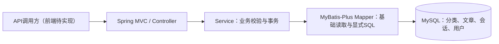

# 架构与版本路线

[项目入口](../README.md)

## 当前：传统业务先行

三个新模块独立走三层架构，没有AI依赖；实体使用普通Java类，输入使用独立DTO。无无意义Service接口、通用CRUD基类或额外组件。当前直接返回不含敏感字段的实体；用户内部服务使用UserResponse排除密码，UserAccount另加JsonIgnore防止误序列化哈希。

旧consultation/draft包、Python代码和原咨询表保留兼容。旧生成接口需要Python，新传统业务不需要；后续AI阶段再迁移旧实现，当前不把它作为底座。

## 模块与规则

| 模块 | Controller / Service / Mapper前缀 | 规则 |
| --- | --- | --- |
| 文章分类 | ArticleCategory | ENABLED / DISABLED；被文章引用时禁止删除 |
| 知识文章 | KnowledgeArticle | DRAFT / PUBLISHED；分类必须存在 |
| 咨询会话 | ConsultationSession | OPEN / CLOSED；当前只管理标题和备注，不生成消息 |

分类状态当前是管理标记，不联动文章发布；会话CLOSED仍可修改元数据或重新设OPEN。V2有用户表和可空会话user_id，但仍无鉴权，只有合成演示数据；V3/V4完成认证和归属访问控制后，才能进行多用户试用。

## 持久化与接口边界

新增表及外键见[schema](schema.md)。新接口见[api](api.md)。旧表和接口字段保持原约定，不删除旧数据；仅为新会话表增加可空user_id，旧响应不增加字段。

创建/更新及读回在TransactionTemplate短事务内。写入携带version，SQL以id/version条件更新，成功加1；影响0行返回409，避免旧请求覆盖。删除同样携带version。分类的删除保护最终由MySQL外键保证，避免先查后删的竞态。

分页默认20、最多100，页码1–1000，按created_at/id倒序；多查一条生成hasMore。keyword通过LOCATE绑定参数进行字面子串查询，未做全文索引或大数据优化。新表DATETIME按UTC存储，接口无偏移时间字符串也按UTC解释。

400输入错误，404记录不存在，409版本或外键约束冲突，503数据库连接不可用，500其他数据库错误。requestId用于定位请求，不是业务主键或幂等键。提交响应中断时需重新查记录确认结果。

## V2用户与持久层边界

- 使用[MyBatis-Plus Boot4 Starter](https://baomidou.com/en/getting-started/install/)替换原Starter，不叠加两套自动配置。三个传统Mapper继承BaseMapper，Service真实调用selectById。自定义写方法另起名称，避免覆盖框架SQL。
- 不启用乐观锁或分页插件：既有SQL已经处理版本和分页，叠加插件会使行为难以解释。
- UserAccountService.createCustomer → BCrypt → 短事务 → UserAccountMapper.insertCustomer → MySQL → UserResponse。用户名去首尾空格、转小写，唯一索引防并发重复。没有默认账号。
- [Spring Security Crypto](https://docs.spring.io/spring-security/reference/features/integrations/cryptography.html)只提供密码工具，不开启安全过滤器。BCrypt强度12，编码在事务外，避免耗时计算占用数据库连接。
- 历史会话user_id为NULL。SessionOwnershipService仅是内部迁移方法，核实归属后才能调用；WHERE id/version/user_id IS NULL防止覆盖已有归属。数据库外键阻止不存在用户和删除被引用用户。
- 当前不批量认领旧会话、不开放归属API。V3应从认证上下文获得当前用户，历史未归属记录不能自动向任意客户开放；账号禁用和授权留到V3/V4。

## 后续阶段及完成门槛

| 版本 | 内容 | 验收门槛 |
| --- | --- | --- |
| V1（已完成） | 三个传统CRUD，MyBatis + 真实MySQL | 正常/异常CRUD、条件分页、关联保护、重启读回；无需AI服务 |
| V2（本次完成） | 持久层整理/MyBatis-Plus、用户表及归属迁移 | Entity→Mapper→SQL→Table映射、旧数据兼容；密码仅哈希保存 |
| V3（待确认） | 注册登录、JWT/Spring Security、客户/商家、前端基础 | Bearer认证、有效期、禁用账号、401/403、前后端实际调用 |
| V4（待确认） | 完整传统业务工作台、用户信息与状态、业务归属校验 | 无AI时完成用户与业务全流程；角色越权和数据越权测试 |
| V5（待确认） | Spring AI、外部兼容模型 | 无密钥Mock可运行；真实模型配置、费用预算、异常与超时验证 |
| V6（待确认） | 会话消息、多轮上下文、结束后的对话评估 | 先存用户消息、再生成并存AI消息；失败可追溯，评估不混同事实正确率 |
| V7（待确认） | SSE流式对话 | 浏览器增量显示、取消/断连处理、最终消息落库、不重复保存 |

V1已使用真实MySQL，不为版本命名退回内存存储。V2进一步整理映射，不重复声称首次引入数据库。角色按用户最后明确的客户/商家两种，不同时引入另一套普通用户/管理员体系。

传统后端稳定后才做AI；最终业务Service可调用AI扩展，但创建/查询/人工处理不能依赖模型可用。SSE是HTTP响应流，不是MQ。V7完成后若有实际性能问题，再提醒评估Redis、MQ、限流等；当前不预埋这些组件。
