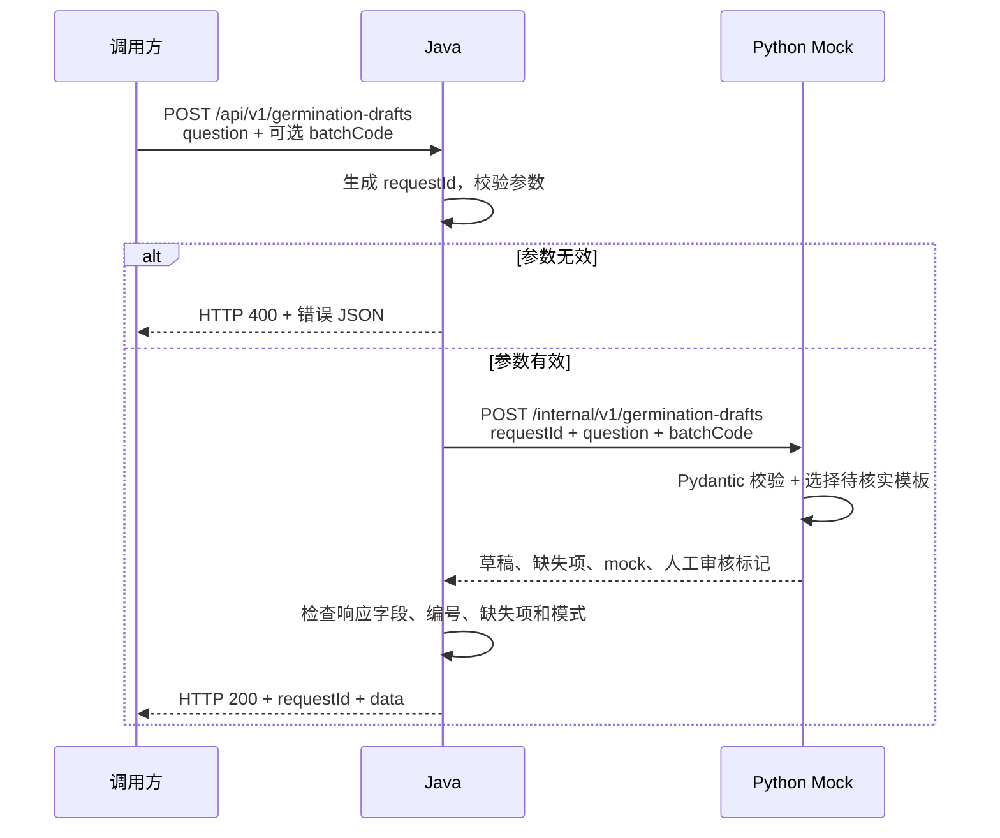

# 第二阶段：发芽率咨询的 Java → Python 调用链

## 场景与边界

商家收到“这个种子发芽率多高？”后，提交问题和可选批次号，得到一份待人工核实的草稿。依据整体计划书，批次发芽率不能从宣传话术或其他批次推断；本阶段没有真实证据，因此只提示补资料，不填任何发芽率数字。

Mock 是确定性模板，不分析问题语义，不是实际大模型。此 API 的用途已经限定为发芽率咨询，不声称能回答所有种植问题。收到其他问题也只会返回这个场景的模板，调用方应使用正确入口。

## 完整数据流

Java 连接失败返回 503，超时返回 504，上游非成功状态或不合约定返回 502。错误不伪装成 HTTP 200，也不透传 Python 的原始异常、内部 URL 或堆栈。

## 文件职责

| 文件 | 新增/修改 | 职责 |
| --- | --- | --- |
| backend-java/pom.xml | 修改 | 加 Validation starter，处理输入和输出结构校验 |
| backend-java/src/main/resources/application.yml | 修改 | Python 地址、连接及读取超时 |
| backend-java/src/main/java/com/seedassistant/draft/DraftModels.java | 新增 | Java record 定义请求、跨服务请求、结果和外层响应 |
| backend-java/src/main/java/com/seedassistant/draft/DraftController.java | 新增 | 接收请求，触发 @Valid，再调用 Python 客户端 |
| backend-java/src/main/java/com/seedassistant/draft/PythonDraftClient.java | 新增 | 配置并复用 RestClient，发送 JSON，验证上游结果 |
| backend-java/src/main/java/com/seedassistant/common/RequestIdFilter.java | 新增 | 为请求生成 UUID，放入响应头并传递到处理方法 |
| backend-java/src/main/java/com/seedassistant/common/ApiExceptionHandler.java | 新增 | 将参数、网络和上游异常映射成统一错误 JSON |
| backend-java/src/test/java/com/seedassistant/DraftApiTest.java | 新增 | 启动真实 Java HTTP 服务和测试用上游，检查正常及失败路径 |
| ai-service/app/schemas.py | 新增 | Pydantic 输入与输出约定，限制字段并拒绝未知输入字段 |
| ai-service/app/mock_generator.py | 新增 | 单一场景模板函数，不调用外部 AI，不读取数据库 |
| ai-service/app/main.py | 修改 | 注册内部草稿 HTTP 路由，保留健康接口 |
| ai-service/tests/test_draft.py | 新增 | 有无批次、非法字段、避免照搬虚假发芽率的测试 |
| scripts/smoke-draft.ps1 | 新增 | 只请求 Java，验证真实双服务调用；可检查 Python 停止后的 503 |
| AGENTS.md、docs/MVP-v0.1.md | 修改 | 记录最新阶段授权，后续阶段待确认 |
| README.md、开发记录、测试报告、本文件 | 修改/新增 | 启动演示、取舍、结果和学习记录 |

## 为什么这样选：五个知识点

1. **Java record 与 JSON。** record 像固定格式的交接单。Java 将字段编码成 JSON 发给 Python，再把 JSON 解码为结果对象；两端必须约定字段名和类型。
2. **Spring MVC 与 Validation。** Controller 是接待窗口，@RequestBody 接收单据，@Valid 触发表单检查。非法输入返回 400，而且测试验证了它不会进入 Python，减少无效调用。
3. **RestClient 与同步 HTTP。** 复用 Spring Web 自带的 RestClient，调用代码从上到下执行，比引入响应式框架更容易理解。它像拨电话等待答复，因此必须设置超时；未来真实模型慢时需重新评估同步方案，不预建队列。
4. **Python FastAPI、Pydantic 与 Mock。** FastAPI 注册窗口，Pydantic 检查格式，普通 Python 函数选择模板。Mock 让业务协议无需模型密钥就能验证，但它不能证明 AI 准确。
5. **异常边界与请求编号。** 上游服务可能宕机、超时或返回错误字段。Java 不能直接相信 HTTP 200；requestId 像同一张交接单的流水号，便于比对请求与响应，它不是登录凭证或数据库编号。

RestClient 已随 Spring Web 提供，没有新增 HTTP 客户端依赖；JDK HttpClient 承担底层网络传输。唯一新增直接依赖是 spring-boot-starter-validation。Python 依赖版本保持上一阶段不变。技术依据：[Spring RestClient 官方说明](https://docs.spring.io/spring-framework/reference/integration/rest-clients.html)。

## 测试层次

- Python 测试在进程内验证实际路由与模板。
- Java 测试启动随机端口，测试上游只存在于测试代码，用来稳定模拟延迟、错误和坏数据；生产代码没有故障开关。
- 端到端脚本请求真实 Java，再由它调用真实运行的 Python，不用测试替身。能成功才证明整条链路可运行。

故障演示：启动 Java 后停止 Python，再运行 `powershell.exe -NoProfile -ExecutionPolicy Bypass -File scripts/smoke-draft.ps1 -ExpectUnavailable`。脚本预期 503/AI_UNAVAILABLE，不会停止任何服务。

## 尚未实现与下一阶段建议

尚未实现数据库、咨询历史、人工编辑确认、登录权限、前端、真实 AI、知识检索、发芽率事实判断、语音、微信接口、异步队列和性能优化。重启不会保留任何业务请求；重复请求会重新计算，不具备持久化幂等保证。

下一阶段建议只做“保存咨询、原始草稿和人工确认结果，并能查询历史”，届时先明确字段和 SQL 初始化脚本，仅通过现有 localhost:3306 连接；需要的账号信息未配置前不操作数据库。该建议尚未实施，等待用户确认。
